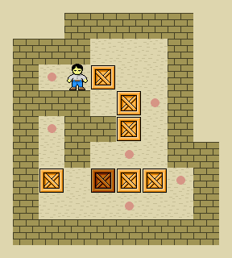

# Projeto XXXX
## FPRO/MIEIC, 2021/22
## Fulano de Tal (up2021xxxxx)
## 1MIEICXX

### Objetivo

1. Criar um clone do clássico Sokoban em Pygame...

2. Em alternativa... do clássico x em Pygame.

### Repositório de código

1) Link para o repositório do GitHub: https://github.com/@author/xxx

2) Adicionar, como colaborador com permissão de leitura (*role read*):

- https://github.com/AfonsoSalgadoSousa
- https://github.com/jlopes60
- https://github.com/nmacedo
- https://github.com/rpmcruz
- https://github.com/eSoares
- https://github.com/pbv
- https://github.com/imdcode
- https://github.com/acoelho-fe-up-pt

### Descrição

*---É um jogo de puzzle em que o objetivo do jogo é empurrar caixotes para um sítio indicado. 
Para empurrar o caixote é preciso ir ao outro lado empurrá-lo. 
Ou seja, se ele ficar junto à parede, a pessoa precisa de reiniciar o jogo. Estamos a utilizar os níveis do XSokoban.---*

### UI

### Pacotes

- Pygame

### Tarefas

1. carregar os níveis
1. desenhar a matriz do nível
1. ler teclas e mover as peças
2. verificar se jogador chegou ao fim do nível

- Atualizado a última vez em 07/12/2021
